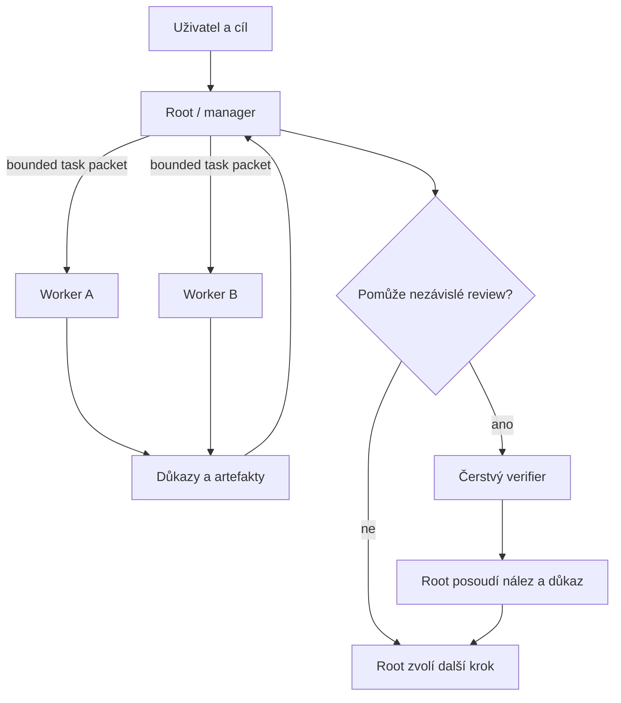

# Iron Box — motivace a design rationale

## Proč Iron Box vzniká

[Iron Box](https://github.com/LookAsPelc/governed-workflow) nevzniká proto, že
by dnešní coding agenti byli příliš slabí. Vzniká téměř z opačného důvodu:
modely jsou už dost schopné na to, abychom jim mohli svěřit dlouhou a složitou
práci. Schopnost vyřešit jednotlivý problém a schopnost spolehlivě řídit celý
dlouhý proces jsou však různé vlastnosti, které se v praxi mohou rozcházet.

To jsou dvě různé vlastnosti:

> **Model capability:** Dokáže model tento problém vyřešit?

> **Workflow reliability:** Dokáže celý systém po desítky kroků udržet správný
> cíl, stav, kontext, kontrolu a důkazy?

Iron Box řeší druhou otázku. Je to malá řídicí konstrukce kolem agentů, která
pomáhá držet hranice práce, směrovat ji na vhodný model, oddělovat pracovní
kontexty a převádět tvrzení na ověřené výsledky. Nezvyšuje inteligenci modelu a
neslibuje, že z každého procesu udělá spolehlivý proces. Snaží se vytvořit
podmínky, ve kterých lze rostoucí schopnosti modelu použít bez toho, aby se
během dlouhé práce ztratil původní záměr.

To je důležité rozlišení i pro očekávání člověka. Model může správně napsat
funkci, ale celý workflow může selhat proto, že funkce řeší špatně pochopené
zadání, navazuje na neověřený předpoklad, změnila rozsah úkolu nebo nebyla
zkontrolována v kontextu skutečného cíle. Iron Box proto nestaví na dojmu, že
další agent nebo delší prompt automaticky vyřeší problém. Staví na menších
pracovních jednotkách, explicitní odpovědnosti a důkazech, které může člověk
prohlédnout.

## Délka úlohy není totéž co délka běhu modelu

[METR ve studii dlouhých úloh](https://arxiv.org/html/2503.14499v4) měří takzvaný
task horizon jako délku lidského času potřebného k dokončení úlohy při zvolené
úrovni úspěšnosti. Nejde o počet sekund, po které model běží, ani o délku jeho
jednoho API volání. Jde o odhad, jak dlouhou práci člověka agent ještě dokáže
spolehlivě zvládnout.

Tento rozdíl je praktický. Úloha, která člověku zabere deset minut, může být
pro agenta krátká i tehdy, když model dostane několik kontextových doplnění.
Úloha, která člověku zabere dva dny, může být dlouhým horizonem i tehdy, když
se jednotlivé kroky technicky vykonají rychle. METR ukazuje rychlý růst této
schopnosti, ale také to, že spolehlivost s délkou úlohy stále klesá a že měření
se nemá automaticky zobecňovat na každý typ práce nebo každý reálný software.

U krátkého úkolu může jeden agent přečíst zadání, promyslet řešení,
implementovat ho a spustit testy. U delší práce vzniká řetězec interpretací,
plánů, výzkumu, implementace, zpětné vazby, oprav a integrace:

```text
zadání → interpretace → plán → implementace A → review
       → změna plánu → implementace B → ověření → integrace
```

Každý jednotlivý krok může vypadat rozumně, přesto se na začátku může usadit
chybný předpoklad. Později se z hypotézy stane zdánlivý fakt a další kroky jsou
provedeny pečlivě, jen řeší trochu jiný problém. Dlouhá úloha proto není jen
testem schopnosti modelu psát kód. Je také testem toho, zda proces udrží
správný cíl v čase.

Iron Box z tohoto měření nedovozuje, že jeho vlastní pravidla zvyšují task
horizon o konkrétní hodnotu. To by vyžadovalo samostatné kontrolované měření.
METR zde poskytuje motivaci: s rostoucí délkou práce roste hodnota dobrého
řízení, explicitního stavu a přiměřeného ověřování.

## Kontext je pracovní prostor, ne dokonalá paměť

Velké context window řeší kapacitu, nikoli automaticky užitečnou dostupnost
informací. Model může mít určitou informaci fyzicky v kontextu, ale při
rozhodování jí nemusí dát správnou váhu. Záleží na množství okolního textu,
podobnosti jednotlivých tvrzení, stáří hypotéz, pořadí a struktuře materiálu.

[Chroma ve výzkumu Context Rot](https://www.trychroma.com/research/context-rot)
testovala 18 modelů na úlohách s rostoucí délkou a s rušivými informacemi.
Pozorovala nejednotné zhoršování výkonu: dopad délky a distractorů se lišil
mezi modely a úlohami. Výsledky nepodporují jednoduché univerzální pravidlo,
že po přesně stanoveném počtu tokenů musí každý kontext zahodit. Podporují ale
opatrnější závěr, že délka kontextu sama o sobě není záruka relevance.

Po delší práci může hlavní vlákno obsahovat původní zadání, několik plánů,
výstupy workerů, implementaci, opravy, review, vysvětlování review i neúspěšné
pokusy. Všechno se tam může vejít, ale model pak musí z hlučného pracovního
prostoru vybrat, co je skutečně závazné.

Proto v Iron Boxu platí:

> **Context is a resource, not an archive.**

Kontext je pracovní prostor. Není nutné do něj navždy ukládat každý detail
historie. Cílem není bezmyšlenkovitě zkracovat všechny konverzace. Cílem je
rozlišit, co aktuální krok opravdu potřebuje, co je ověřený fakt a co je jen
historická stopa.

## Root řídí celek a deleguje práci

Z tohoto rozlišení vzniká root/manager a worker. Root drží původní cíl,
hranice úkolu, rozhodnutí o dalším kroku, integraci a komunikaci s člověkem.
Worker řeší konkrétní ohraničený problém v kontextu, který je pro něj
relevantní.



Worker nepotřebuje celou historii projektu. Potřebuje cíl, relevantní fakta,
omezení, akceptační kritéria a očekávaný důkaz. Root tím nepřestává odpovídat
za výsledek. Naopak: jeho práce je zkontrolovat relevantní artefakty a
rozhodnout, zda workerův výsledek skutečně řeší původní záměr.

Delegace tedy není způsob, jak root přestane přemýšlet. Je to způsob, jak root
nezahltí vlastní kontext implementačními detaily a přitom si ponechá přehled o
tom, co se změnilo. Root deleguje implementaci a rutinní běh kontrol workerům;
na konci musí rozumět podstatným změnám, prohlédnout relevantní diffy a důkazy
a rozhodnout, zda výsledek odpovídá původnímu cíli. Úspěšný test může potvrdit
syntaktickou nebo funkční vlastnost; sám o sobě nemusí potvrdit, že byl splněn
skutečný záměr uživatele.

To platí i pro tento dokument. Mechanické zkrácení motivační eseje může projít
kontrolou syntaxe Markdownu a může obsahovat všechny hlavní názvy komponent,
ale přesto ztratit vysvětlení, proč komponenty existují a jak souvisí s
problémem. Test tedy není důkazem, že změna zachovala záměr dokumentu.

## Proč je task packet malý a explicitní

Předání workerovi není pokračování dlouhého chatu. Je to malý pracovní
kontrakt. Měl by říct:

* co přesně se má změnit nebo zjistit,
* která fakta jsou již ověřená,
* jaká omezení musí zůstat zachována,
* podle čeho poznáme dokončení,
* jaký artefakt nebo důkaz má worker vrátit,
* kdy má práci zastavit a eskalovat.

Tato hranice chrání před několika různými selháními. Explicitní hranice sama scope driftu nezabrání, ale ztěžuje jeho skrytí a dává
rootu možnost ho při review odhalit. Nedostává
staré hypotézy, které nejsou pro aktuální krok nutné. Dva skutečně nezávislé
úkoly mohou běžet v čistých kontextech. A pokud se práce přeruší, lze se vrátit
k popsanému úkolu a jeho artefaktům místo hádání, kde v dlouhém chatu skončila.

Instrukce určené výhradně rootu nemají být workerovi předávány s poznámkou,
že je má ignorovat; mají zůstat fyzicky mimo worker packet. Je to návrhová
hranice workflow, nikoli tvrzení o tom, co každý host již podporuje.

Bounded packet není samoúčelná ceremonie. Pro triviální změnu může být velmi
krátký. Pro rizikovou změnu musí být přesnější. Hranice má odpovídat tomu, co
se může pokazit.

## Stejný worker, nebo čerstvý pokus

Čerstvý kontext není vždy lepší. Když worker přesně dokončil změnu v jednom
modulu a potřebuje malý navazující krok, je užitečné použít stejného workera:
zná relevantní terminologii, strukturu změny i místní omezení. Přesný follow-up
tak nemusí platit náklady na nové vysvětlování.

Čerstvý worker má jinou hodnotu, když potřebujeme nezávislé posouzení, když se
oblast práce změnila, když je předchozí kontext přetížený nebo zastaralý, anebo
když jsou patrné známky fixace na chybném řešení. Nový agent má dostat stejný
cíl, aktuální ověřená fakta a kritéria úspěchu, ale nemusí dostat celý příběh
předchozího pokusu.

To není tvrzení, že nový model vždy najde pravdu. Je to řízení konkrétního
rizika: autor řešení má přirozeně důvod pokračovat ve vlastní hypotéze, zatímco
čerstvý kontext může nabídnout jiný pohled. [Studie The Self-Correction
Illusion](https://arxiv.org/html/2606.05976v2) ukázala, že stejný chybný výrok
model opravoval různě podle toho, zda byl prezentován jako jeho vlastní dřívější
odpověď, nebo jako tvrzení z externího zdroje. To podporuje závěr, že role a
kontext ovlivňují kritické posouzení. Neprokazuje, že nezávislí revieweři jsou
vždy správní.

Proto Iron Box nepřikazuje nový worker po každé chybě. Manager rozhoduje podle
toho, zda další krok těží ze znalosti místního řešení, nebo potřebuje odstup.

## Worker report není důkaz

Nejdůležitější praktické pravidlo zní:

> **Agent output is a claim, not proof.**

Worker může napsat „tests pass“, „bug je opraven“ nebo „implementace splňuje
zadání“. Je to užitečný report, ale stále jen tvrzení. Worker řešení vytvořil a
často zároveň navrhl způsob, jak je hodnotit. Proto root převádí report na
ověřený výsledek pomocí artefaktu, který lze zkontrolovat:

```text
worker report → diff, běh, test, dokumentace nebo jiný artefakt
              → úsudek rootu podle původního cíle
```

Deterministická kontrola může ověřit, že soubor existuje, JSON je validní nebo
test skončil s exit code 0. Neověří sama, zda test pokrývá skutečný záměr,
zda změna nevytvořila architektonický problém nebo zda se scope neposunul.
Tam, kde je třeba úsudek, může root využít čerstvý read-only verifier. Ten má
vracet `PASS`, `REVISE` nebo `BLOCKED` spolu s nálezem, důkazem a nejistotou.

Ani `PASS` ale nemá být jediným dlouhodobým faktem. Přesnější je uložit nebo
uvést, že konkrétní testy prošly na konkrétním diffu či commitu a co tím bylo
ověřeno. Verifier pomáhá s úsudkem; root odpovídá za to, jak výsledek zapadne
do cíle.

## Náklady koordinace a routing modelů

Každý další agent přidává tokeny, čas, koordinaci, další výstup ke čtení a
možnost rozporu. Více agentů proto není automaticky více spolehlivosti.
Koordinace sama něco stojí. U jednoduchého úkolu může být levnější jeden
worker a deterministický test než worker, verifier a další arbitr.

Terra, Luna a Sol zde nejsou organizační hierarchie ani trvalé persony. Jsou to
názvy používané pro volbu modelu nebo doporučené cesty podle konkrétního hosta.
Doporučení pro volbu modelu rootu patří do [README](../README.md), zatímco
routing workerů a reasoning effort řídí [governance skill](../skills/iron-box-orchestration/SKILL.md).
Root volí nejlevnější dostupnou volbu, která má podle rizika rozumnou šanci
úkol spolehlivě zvládnout.

Přesné podporované profily a doporučené úrovně effortu patří do sdíleného
[governance skillu](../skills/iron-box-orchestration/SKILL.md), který je
jediným místem pro jejich proceduru. Tato esej vysvětluje důvod routingu, ale
nekopíruje jeho tabulky a nesnaží se znovu vytvořit druhý konfigurační manuál.
Tím se snižuje riziko, že se stejná pravidla rozjedou ve dvou souborech.

Pravidlo je jednoduché: jeden worker, pokud jeden worker stačí. Fan-out má
konkrétní důvod — například skutečnou nezávislost úkolů nebo potřebu druhého
pohledu — a root musí umět vysvětlit, proč jeho přínos převyšuje koordinační
náklad.

## Recovery stojí na projektových artefaktech

Orchestrace a dlouhodobé pokračování jsou příbuzné, ale odlišné problémy.
Iron Box nevytváří vlastní ledger ani jiný persistentní stav. Pokud existují,
zdrojem pravdy mají zůstat artefakty použitého
vývojového workflow: kód, diff, git historie, specifikace, implementační plán,
progress soubor, testy a review nálezy.

[Anthropic ve svých experimentech s long-running coding agenty](https://www.anthropic.com/engineering/effective-harnesses-for-long-running-agents)
popisuje praktickou hodnotu malých ověřitelných kroků, Git historie a
explicitního progress souboru, ze kterého další agent zjistí, co bylo hotovo a
kde pokračovat. Jde o zkušenost z engineering experimentů, ne o kontrolovaný
důkaz, že multi-agent workflow je vždy lepší.

Iron Box z této zkušenosti přebírá omezený designový závěr: když se má práce
obnovit, je lepší předat nový kontextuální balíček založený na existujících
artefaktech než kopírovat celý chat. V projektu, který už používá Superpowers,
je proto přirozené obnovovat práci z jeho plánů a progress artefaktů. Iron Box proto nepřidává vlastní stav jen proto, aby znovu popsal stav, který
je již v projektových artefaktech.

To ponechává člověku kontrolu. Může otevřít diff, plán, test nebo progress
soubor a rozhodnout, zda je výsledek skutečně dostatečný. Obnova není magická
paměť agenta; je to nové rozhodnutí založené na dohledatelných pracovních
produktech.

## Co výzkum podporuje a co z něj nedovozujeme

[LongHorizon-Harness](https://arxiv.org/html/2608.01964v1) a jeho
[veřejná implementace](https://github.com/AMAP-ML/LongHorizon-Harness) oddělují
management, execution a audit a mezi kroky přenášejí kompaktní stav a důkazy.
Tento rámec je pro Iron Box relevantní jako příklad oddělení kontextu, práce a
kontroly. Jeho výsledky ale nevalidují konkrétní routing Iron Boxu a Iron Box
není jeho kopií ani novým runtime.

Podobně METR motivuje práci s task horizonem, Chroma motivuje opatrnost vůči
dlouhému a rušivému kontextu, Self-Correction Illusion motivuje odstup při
review a Anthropic motivuje malé ověřitelné kroky s projektovým stavem. Žádný z
těchto zdrojů sám o sobě nedokazuje, že právě tato kombinace pravidel zlepšuje
každý software workflow. Iron Box je designová inference z těchto problémů a z
praktické práce s agenty; jeho vlastní přínos by se musel měřit zvlášť.

## Přenositelnost a onboarding

Základní principy Iron Boxu nejsou vázané na jednoho hosta: bounded task,
oddělený pracovní kontext, report jako tvrzení a důkaz, přiměřené ověřování a
obnova z artefaktů mohou fungovat v různých prostředích. Naopak dostupné modely,
TOML profily, marketplace nebo způsob aktivace jsou vlastnosti konkrétního
klienta.

Toto rozdělení chrání přenositelnost i vývojáře. Změna klienta nemá přepsat
obecnou filozofii a workaround pro jednu verzi klienta nemá být vydáván za
princip governance. Obecná pravidla zůstávají malá; host-specific integrace
řeší konkrétní host.

Stejně tak onboarding není orchestrace. Onboarding vysvětluje, co je potřeba
zprovoznit a jaké hranice má prostředí. Orchestrace řídí konkrétní práci.
Superpowers poskytují vývojové workflow a artefakty. Iron Box vysvětluje, kdy
delegovat, jak předat bounded packet a jak požadovat důkaz. Tyto vrstvy se
doplňují, ale nemají se slévat do jednoho obřího promptu nebo skrytého
administrativního systému.

Developer zůstává v řídicí smyčce. Má mít možnost vidět, který profil byl
zvolen, jaký kontext worker dostal, jaký artefakt vznikl a proč se workflow
zastavilo nebo eskalovalo. Iron Box nemá tiše publikovat, deployovat ani měnit
externí systémy. Má pomoci s rozhodováním a kontrolou, ne odebrat člověku
rozhodovací pravomoc.

## Co Iron Box záměrně není

Iron Box není agentní firma s povinným katalogem managerů, researcherů,
architektů a testerů. Není to systém maximalizující autonomii, prompt framework
ani archiv celé konverzace. Není to ani povinná ceremonie, ve které každý malý
úkol prochází několika agenty a Sol musí schválit každý výsledek.

Root má delegovat, když delegace pomáhá, a nemá přebírat rutinní implementaci
nebo běžné kontroly jen proto, že je může vykonat sám. Má použít čerstvý
verifier, když je potřeba nezávislý úsudek, a vystačit s deterministickým
důkazem, když je otázka přesně měřitelná. Má měnit jen tu část plánu, kterou
nová informace skutečně zneplatnila.

## Závěr

Další krok ve vývoji coding agentů není pouze „dej agentovi inteligentnější
model“. Stejně důležité je vytvořit prostředí, ve kterém může schopný model
zůstat orientovaný i při dlouhé práci.

METR ukazuje, proč je třeba brát vážně délku lidské úlohy a klesající
spolehlivost s jejím růstem. Chroma ukazuje, proč kapacita kontextu není totéž
co užitečná relevance. Self-Correction Illusion ukazuje, proč záleží na tom,
zda review probíhá v kontextu autora nebo s odstupem. Anthropic ukazuje
praktickou hodnotu malých kroků, Git historie a explicitního progressu.
LongHorizon-Harness ukazuje jednu možnou architekturu oddělení správy,
provádění a auditu, ale není důkazem ani implementací Iron Boxu.

Iron Box z těchto pozorování vytváří skromnější design: jasný cíl, bounded
delegaci, přiměřené routování, ověřitelné artefakty, čerstvý kontext tam, kde
opravdu pomáhá, a obnovu založenou na projektu.

V tomto smyslu není „box“ další agent. Je to malá řídicí konstrukce kolem
agentů, která má zabránit tomu, aby se jejich rostoucí schopnosti ztratily v
dlouhém, hlučném a špatně kontrolovaném procesu.
