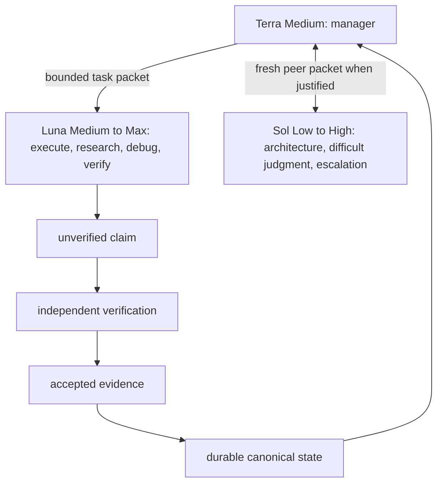

# Iron Box orchestration

Iron Box is a lightweight governance layer over native Codex orchestration. It
does not add an agent runtime, supervisor, or daemon. Terra is the root
manager, Luna is the default execution pool, and Sol is optional expensive
judgment.

## Manager ownership and development gate

Terra Medium owns user intent, protected constraints, Goal and TODO creation,
decomposition, routing, task-state management, context-packet construction,
verification decisions, integration, and user communication. Terra is not an
implementation worker. Keep the manager context focused on contracts, settled
decisions, accepted evidence, and next actions—not raw worker reasoning.

Before development, record a Goal and a TODO list with acceptance criteria and
the evidence needed to close each item. Ask the user for missing product intent.
For an architecture, security, public-interface, migration, destructive, or
otherwise one-way-door decision, use Sol as a fresh peer or obtain the user's
decision before implementation.

## Economic routing

Choose the cheapest model and reasoning effort that can reliably meet the
required epistemic standard. Model tier is not organizational rank.

| Route | Use when |
| --- | --- |
| Luna Medium | Routine bounded implementation, research, deterministic checking, or mechanical review |
| Luna High | Non-trivial implementation, debugging, semantic review, or broader research |
| Luna Xhigh/Max | Difficult but bounded reasoning after complexity, risk, or a prior failure justifies it |
| Sol Low/Medium/High | Architecture peer work, ambiguous trade-offs, high-risk correctness/security, evidence conflict, repeated Luna failure, or high-value review |

Do not route implementation to Terra. Do not invoke Sol mechanically for every
review: a fresh Luna verifier is normally sufficient when deterministic evidence
is strong. Terra chooses the worker and effort; users normally need not
micromanage reasoning effort.

## Bounded context packets and roles

Every worker receives only the objective, relevant protected constraints and
settled decisions, exact ownership, acceptance criteria, relevant verified
state/evidence, and known risks. Do not forward the whole root conversation or
another worker's private reasoning. A worker report must identify changed files
(if any), exact commands/results, observations, uncertainty, and status.

Use these behaviorally distinct profiles:

- **Luna implementer** changes only its bounded scope and reports a claim.
- **Luna researcher** is read-only and separates observations, hypotheses,
  verified facts, recommendations, and uncertainty.
- **Luna debugger** reproduces, isolates, applies the smallest justified fix,
  and reruns the regression check.
- **Luna verifier** is fresh and read-only; it independently tests claims and
  does not repair while verifying.
- **Sol advisor** is a fresh architecture peer, critic, escalation solver, or
  high-value reviewer. It neither implements nor silently changes user intent.

All workers preserve unrelated edits, do not spawn descendants, and escalate
ambiguity, destructive action, execution failure, or an unprovable criterion.

### Context and cost discipline

Before interrupting, respawning, or fanning out, Terra inspects durable state,
active worker status, and the latest evidence. Keep an in-scope worker
progressing when it is making progress. Interrupt only for a changed
requirement, scope or safety violation, bounded retry failure/block, or stale
or contradictory evidence. Never start a duplicate replacement while the
original is active. Fan out only disjoint work with independent acceptance
criteria and evidence, and record a concise rationale when the expected cost or
time benefit justifies it. Reuse stable evidence and context; retries must be
causally distinct rather than repeated blindly.

## Claim -> Verify -> Commit

A worker report is an untrusted claim. It never directly becomes canonical
state. Terra records verified facts only after independent inspection.

1. Luna reports an implementation or research claim with concrete locations.
2. Terra assembles a completion packet containing the goal and protected
   constraints, every acceptance criterion, declared scope, actual diff and
   artifacts, exact commands and results, deviations or workarounds, and all
   capability claims.
3. Every claimed completion, including trivial work, receives a fresh,
   read-only independent review. The default is a Luna verifier; Sol is used
   only when proportional high-judgment review is warranted. Deterministic
   reproducible evidence is decisive input, never a bypass for this fresh scope
   review.
4. The reviewer independently assesses (a) coverage of every criterion, (b)
   out-of-scope files and side effects, (c) unapproved workarounds or
   improvisation, and (d) unsupported or unobserved capability claims. PASS
   requires all four assessments plus evidence; otherwise the completion stays
   unverified/suspect.
5. Terra links accepted evidence to the relevant state record and updates its
   status. Contradicted or incomplete claims remain unverified/suspect.

Evidence preference is: reproducible tests, compiler/type checker/linter,
runtime and API observations, diffs/hashes/file contents; then independent
fresh-agent judgment; then executor self-report. A reviewer must not override
contradictory deterministic evidence merely because a result looks plausible.

## Durable state and recovery

For work that exceeds a small, self-contained change, maintain project-local
state under `.iron-box/` using the protocol in
[`docs/durable-task-state.md`](../../docs/durable-task-state.md). It is ignored
by default because it is runtime task state, not project source. The immutable
`task.json` preserves user intent; mutable `state.json` carries only structured
records and evidence links. Do not use a growing prose summary or raw chat
history as canonical memory.

At each checkpoint, record accepted verification, pending/blocking work,
superseded claims, and artifact fingerprints where a later change would
invalidate evidence. A fresh Terra context resumes by reading `task.json`, then
`state.json`, verifying any stale fingerprints, locating referenced evidence,
and selecting the smallest next bounded action. The root can be logically
persistent without its original conversation being physically necessary.

Trivial low-risk work may use a compact packet and lightweight checks, but it
still requires the same fresh independent completion review before Terra marks
it complete.

## Delivery

The root reviews the diff and evidence, distinguishes static inspection,
command output, and live runtime proof, and discloses unavailable dependencies.
Present the result and unresolved uncertainty for user review before final
cleanup or completion.
