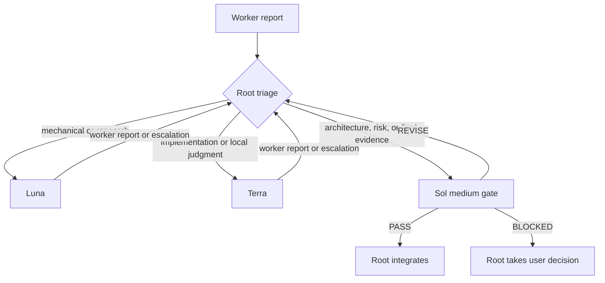

# Iron Box orchestration

This is a workflow contract for delegated work.
It defines ownership, routing, escalation, and evidence without assuming a particular execution environment.

## Root ownership and development gate

The root agent owns the requirement, scope, integration, verification, and all user communication. 
Before development it records a goal and a TODO list; the TODO names acceptance criteria and the evidence needed to close them. 
If the product intent is unknown, the root agent resolves it with the user before assigning implementation, or discusses it with a more powerful subagent in an advisory role.

## Model-routing heuristic

These are recommended routing heuristics:

| Route | Best fit | Relative cost guidance |
| --- | --- | --- |
| gpt-5.6-Luna Medium/High | Bounded, mechanical, or research work | Because 25x cheaper than Sol and 10x cheaper than Terra |
| gpt-5.6-Luna Xhigh/Max | Difficult but still bounded work | May be preferred before Sol Low and Terra Medium |
| gpt-5.6-Terra | Escalated implementation and local judgment | Use when Luna cannot safely decide implementation details |
| gpt-5.6-Sol Low/Medium/High | Architecture, risk, and final-evidence review | Use for the highest-leverage judgment and review |

For Luna's route, prefer a new thread over spawning descendant subagents.
Then control that thread.
Keep any descendant work within the root's explicit scope and escalation decision.

## Worker assignment and evidence contract

Before every assignment, announce the task name, role, model, reasoning level,
and a short purpose. Each worker receives all of the following:

- a distinct, bounded scope and exact file ownership;
- acceptance criteria and the expected verification command or observation;
- an explicit statement that other agents edit the shared workspace;
- escalation conditions for ambiguity, execution failure, destructive action, or an acceptance criterion it cannot prove.

Workers preserve unrelated edits and do not widen scope.
Every worker report lists changed files, exact commands and results, observed behavior, and remaining uncertainty.
The root reviews the report and the diff before integrating it.

## Context packet

The root sends task-specific context rather than the whole history by default:
objective, settled decisions, owned files or interfaces, acceptance and verification checks, relevant evidence, and known risks.
Forward a bounded recent-turn slice only when it is materially needed; never dump unrelated history or secrets.
A worker escalates when this packet is insufficient to prove or safely complete the assignment.

## Escalation path and Sol verdict

Each worker includes an explicit escalation report, even when no escalation is
needed:

```text
status: PASS | ESCALATE | BLOCKED
scope: <files and bounded responsibility>
evidence: <commands, observations, and outputs>
uncertainty: <remaining risk or none>
recommendation: <next route or root action>
```

Use this routing and review path:



Solreturns exactly `PASS`, `REVISE`, or `BLOCKED`, with
evidence and rationale. `PASS` means evidence supports every acceptance
criterion; `REVISE` means a deficiency is correctable within scope; `BLOCKED`
means a required decision, access, or proof is missing. The root owns the
revision loop and the user decision when the gate is blocked.

The root distinguishes static inspection, collected command output, and live runtime evidence.
An unavailable external dependency (network, credentials, database, or authorization) is recorded as an exact limitation, never as proof of completion.
Before delivery, the root presents the result and any unresolved uncertainty for user review; only then does it perform final cleanup or claim completion.
